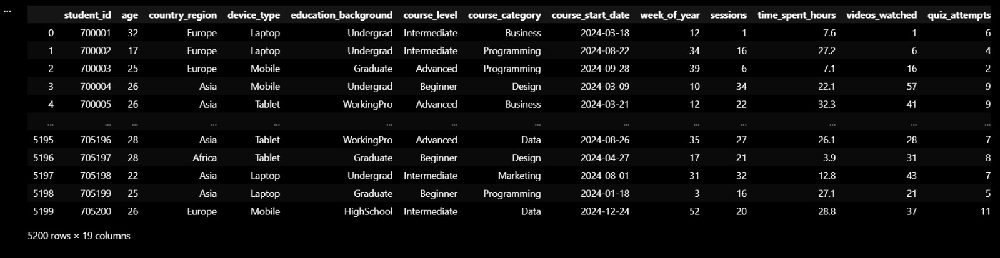
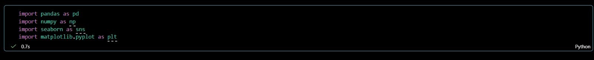
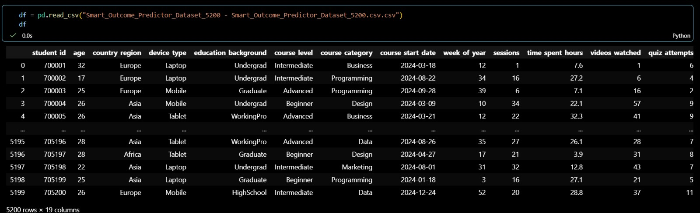
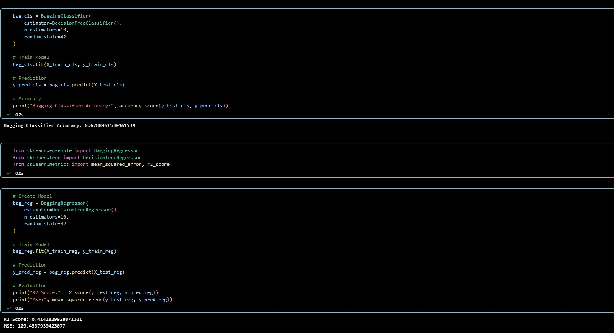
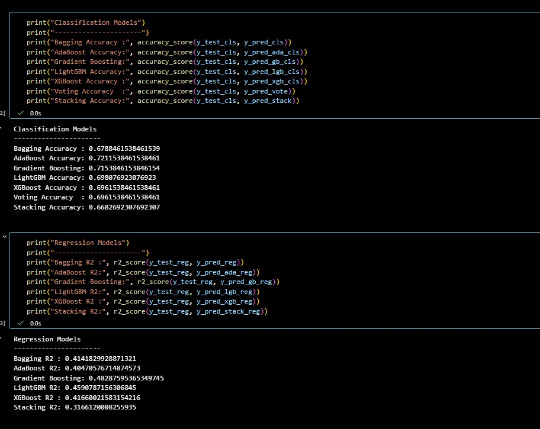
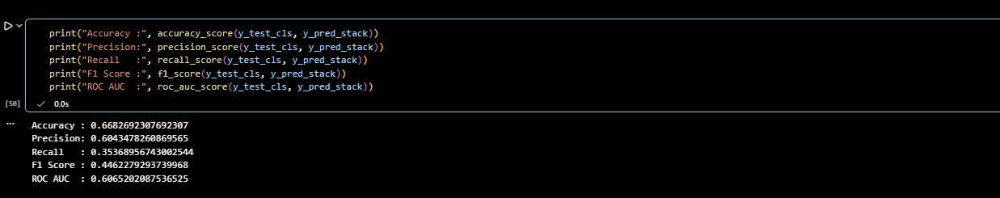

# Smart Outcome Predictor

## 📌 Project Overview

The Smart Outcome Predictor project aims to build a Machine Learning classification model that predicts outcomes based on various input features. The project follows the complete Machine Learning pipeline including data loading, preprocessing, feature engineering, model training, and evaluation.

---

## 🎯 Objective

The primary objective of this project is to:

- Analyze the dataset.
- Handle missing values and categorical variables.
- Train Machine Learning models.
- Evaluate model performance.
- Predict outcomes accurately.

---

## 📂 Dataset Information

**Dataset Name:** Smart_Outcome_Predictor_Dataset_5200.csv

The dataset contains multiple input features and one target variable used for classification.

### Dataset Preview



---

## 🛠️ Technologies Used

- Python
- Jupyter Notebook
- Pandas
- NumPy
- Matplotlib
- Seaborn
- Scikit-Learn

---

## 📚 Libraries Used

```python
import pandas as pd
import numpy as np
import matplotlib.pyplot as plt
import seaborn as sns
```

Machine Learning Libraries:

```python
from sklearn.impute import SimpleImputer
from sklearn.preprocessing import LabelEncoder
from sklearn.preprocessing import StandardScaler
from sklearn.model_selection import train_test_split
from sklearn.linear_model import LogisticRegression
from sklearn.tree import DecisionTreeClassifier
from sklearn.metrics import accuracy_score
```

### Screenshot



---

# 🔄 Project Workflow

## Step 1: Load Dataset

The dataset was loaded using Pandas and stored in a DataFrame.

### Screenshot



---

## Step 2: Data Preprocessing

The dataset was explored and prepared for machine learning by:

- Checking dataset structure
- Handling missing values
- Encoding categorical variables
- Scaling numerical features

---

## Step 3: Model Training

The following Machine Learning models were trained:

- Logistic Regression
- Decision Tree Classifier

### Screenshot



---

## Step 4: Model Evaluation

The trained model was evaluated using Accuracy Score.

### Screenshot



---

# 📊 Results

The trained model successfully predicts the target outcome with good classification performance.

### Final Output



---

# 📈 Machine Learning Pipeline

```text
Dataset
      ↓
Load Dataset
      ↓
Data Preprocessing
      ↓
Feature Engineering
      ↓
Train-Test Split
      ↓
Model Training
      ↓
Prediction
      ↓
Accuracy Evaluation
```

---

# 📂 Project Structure

```text
Smart_Outcome_Predictor/
│
├── Exam5(code).ipynb
├── Smart_Outcome_Predictor_Dataset_5200.csv
├── README.md
│
└── screenshots/
    ├── accuracy_score.png.jpeg
    ├── dataset_preview.png.jpeg
    ├── final_output.png.jpeg
    ├── import_libraries.png.jpeg
    ├── load_dataset.png.jpeg
    └── model_training.png.jpeg
```

---

# ✅ Conclusion

This project demonstrates a complete Machine Learning classification workflow. The dataset was successfully preprocessed and used to train classification models. The model performance was evaluated using the Accuracy Score, and it successfully predicts outcomes based on the given input data.

---

# 👨‍💻 Author

**Abhiraj Medhat**

Machine Learning & Data Science Student
